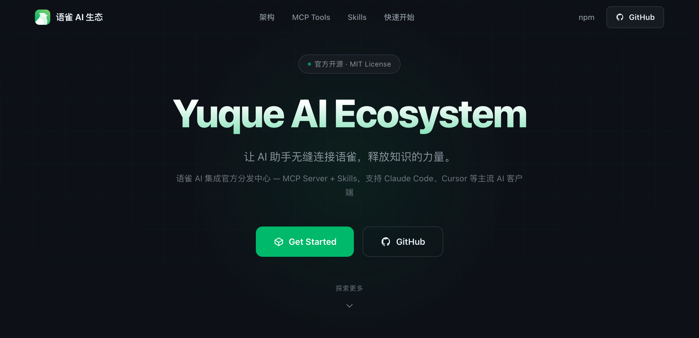

<div align="center">

<a href="https://yuque.github.io/yuque-ecosystem/"></a>

<h1>Yuque AI Ecosystem</h1>

语雀 AI 生态官方分发仓库<br>一套知识管理 Skills，任意 AI 客户端开箱即用。

[![Website][website-image]][website-url] [![Deploy][deploy-image]][deploy-url] [![npm][npm-image]][npm-url]

[🌐 官网](https://yuque.github.io/yuque-ecosystem/) · [🚀 快速开始](#快速开始) · [🤖 Agent 安装](./AGENT-INSTALL.md) · [📖 完整愿景](https://www.yuque.com/yuque/ai/yuque-ai-ecosystem-final) · [English](./README.md)

<a href="https://yuque.github.io/yuque-ecosystem/"></a>

</div>

## Skills（8 个）

- 📥 **daily-capture** — 随手速记灵感，定期整理成结构化知识
- 🔍 **smart-search** — 用自然语言搜索你的语雀知识库并综合作答
- 📝 **smart-summary** — 按一句话 / 要点 / 详细三档总结文档或知识库
- 📚 **reading-digest** — 从文章提炼核心洞见、金句与行动项，生成阅读笔记
- ✨ **note-refine** — 把粗糙小记打磨成结构清晰的文档，保留你的原声
- 🔗 **knowledge-connect** — 发现文档间的关联话题与互补笔记，建立交叉链接
- 🧹 **stale-detector** — 扫描知识库中的过时文档并给出更新建议
- 🎨 **style-extract** — 提炼你的用词、句式与语气，形成个人文风指南

> **团队版（yuque-group）已暂时下线**：其 skills 依赖的团队统计类 MCP 工具（`yuque_group_*`）尚未在 `yuque-mcp` 中提供，待底层工具就绪后再重新上架。历史代码见 git 记录。

## 快速开始

### Claude Code

```bash
# 1. 配置 MCP
claude mcp add yuque-mcp -- npx -y yuque-mcp --token=$YUQUE_TOKEN

# 2. 复制 Skills
REPO_DIR="/path/to/yuque-ecosystem"
mkdir -p ~/.claude/skills
cp -r "$REPO_DIR/skills/"* ~/.claude/skills/
```

### 其他客户端（OpenCode / OpenClaw / Cursor / VS Code / Windsurf …）

两步通用：① 配好 `yuque-mcp`；② 客户端若支持 skills，把 [`skills/`](./skills/) 拷进它的 skills 目录。

各客户端的具体命令见 [`AGENT-INSTALL.md`](./AGENT-INSTALL.md) —— 把这个文件直接丢给你的 AI agent，它就会装。

## 定位

**Skills 是资产，客户端接入是分发，官网是门面。** 能力与体验分属两个仓库：[yuque-mcp-server](https://github.com/yuque/yuque-mcp-server) 定义 AI *能做什么*（MCP 工具），本仓库定义用户*怎么用上*（Skills 编排、安装文档与官网）。

| 层     | 内容                                            | 位置                                                        |
| ------ | ----------------------------------------------- | ----------------------------------------------------------- |
| 能力层 | MCP Server（npm: `yuque-mcp`）                  | [yuque-mcp-server](https://github.com/yuque/yuque-mcp-server) |
| 资产层 | 知识管理 Skills（唯一源，标准 SKILL.md 格式）   | [`skills/`](./skills/)                                      |
| 分发层 | 全客户端安装指南（复制 skills/ 即安装）         | [`AGENT-INSTALL.md`](./AGENT-INSTALL.md)                    |
| 门面层 | 官网（展示 + 安装引导）                         | [`website/`](./website/)                                    |

SKILL.md 是跨客户端的通用格式——OpenCode、OpenClaw 等客户端直接把 [`skills/`](./skills/) 拷进各自的 skills 目录即可，无需专门的适配层。所有客户端统一走「配 MCP + 复制 skills/」两步。

<details>
<summary>仓库结构</summary>

```
yuque-ecosystem/
├── skills/                   # ★ 资产：8 个知识管理 Skills（唯一源）
├── AGENT-INSTALL.md          # 全客户端安装指南（agent 可直接执行）
├── website/                  # 官网（GitHub Pages）
├── scripts/                  # 校验脚本（skills frontmatter 与 MCP 工具引用）
└── .github/                  # CI、预览与部署工作流
```

</details>

## 开发

```bash
# 官网开发
cd website && npm install && npm run dev

# 校验 skills
node scripts/validate-skills.mjs
```

## 链接

- [npm: yuque-mcp](https://www.npmjs.com/package/yuque-mcp)
- [yuque-mcp-server](https://github.com/yuque/yuque-mcp-server) — 能力层：MCP Server 源码
- [语雀 + AI：从文档工具到你的第二大脑](https://www.yuque.com/yuque/ai/yuque-ai-ecosystem-final)

## 许可证

MIT © [Yuque](https://www.yuque.com)

[website-image]: https://img.shields.io/badge/website-yuque.github.io-00B96B?style=flat-square
[website-url]: https://yuque.github.io/yuque-ecosystem/
[deploy-image]: https://img.shields.io/github/actions/workflow/status/yuque/yuque-ecosystem/deploy-website.yml?style=flat-square&label=deploy
[deploy-url]: https://github.com/yuque/yuque-ecosystem/actions/workflows/deploy-website.yml
[npm-image]: https://img.shields.io/npm/v/yuque-mcp?style=flat-square&label=yuque-mcp
[npm-url]: https://www.npmjs.com/package/yuque-mcp
